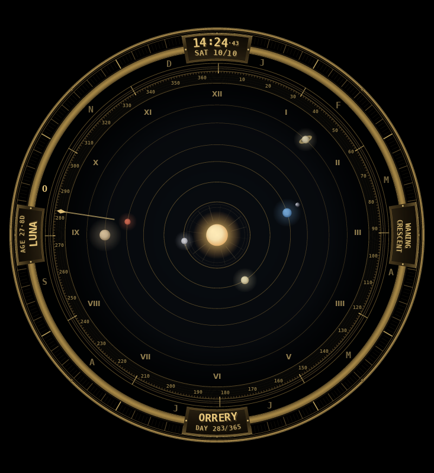
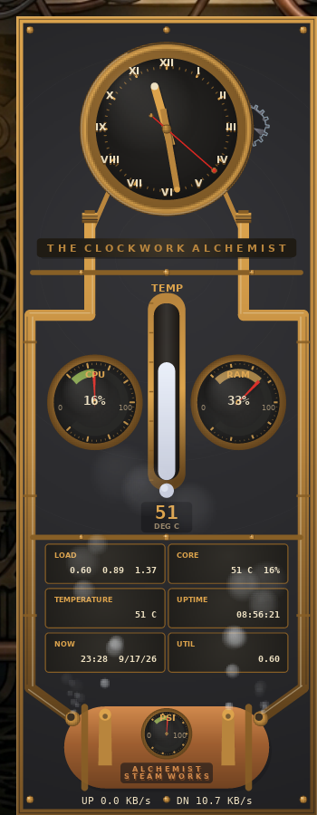
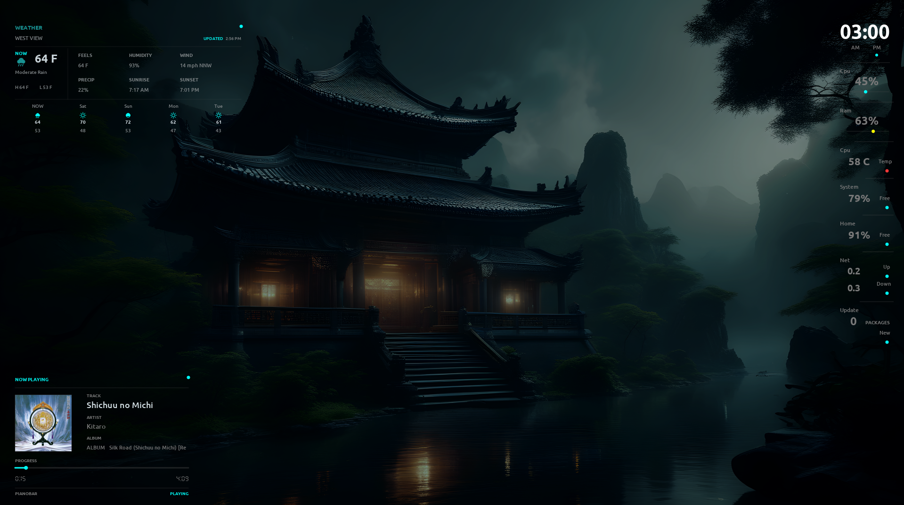
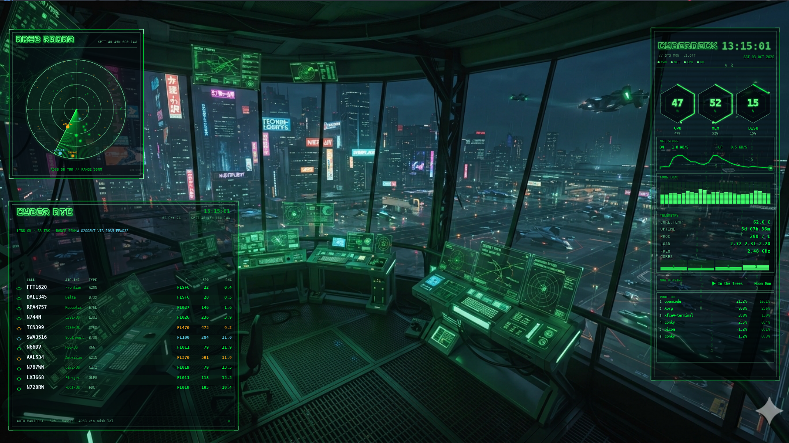

# Conky Configurations

A collection of handcrafted **Lua/Cairo** Conky themes (modern `conky.config = {...}` /
`conky.text = [[...]]` syntax, tested on **Conky 1.12.2**, Bodhi Linux / Moksha).
Free to use, modify, and share.

> Several of these were built together with AI assistants over many live-tuning
> sessions, from original community designs, and **three of the bundled
> wallpapers are AI-generated artwork**. Full per-file provenance — source
> designs, AI contributions, third-party fonts and artwork — is recorded in
> [`ATTRIBUTION.md`](ATTRIBUTION.md).

## Themes

The themes are organised into **families** that share a visual language. The
**Metal** family is a cool black-metal gauge style; **Etched** is a minimal
Etched-style stat/player/weather set; **Cyber** is green-on-black terminal.
**Classics** keep their original brand names, and **Standalone** themes are
one-offs that share no family language.

| Theme | Family | Description |
| :--- | :--- | :--- |
| **metal-sysmon** | **Metal** | Full system monitor: title plate with ROOT/HOME half-ring gauges, 4 clock-style CPU speedometer dials with load %, PROCESSES, NETWORK. Cool black-metal finish. |
| **metal-clock** | **Metal** | The original jpope 2010 clock face with 12 long light-grey major ticks + 48 minors, hands emanating from the inner date/time/day circle. |
| **metal-pianobar** | **Metal** | Metal-gauge pianobar now-playing widget. Part of the **Metal** family, not a pianobar variant — it wears the same black-metal instrument styling as `metal-sysmon` and `metal-clock`. |
| **etched** | **Etched** | Etched-style stat column (clock, CPU/RAM/temps, disks, network) with an Ubuntu-font face. |
| **etched-pianobar** | **Etched** | Minimal pianobar card (cyan accents, no panel): track, artist, album, progress, state dots, album art. |
| **etched-weather** | **Etched** | Horizontal weather card: NOW panel + details grid + full-width 5-day forecast row. OpenWeather API. |
| **cyber-deck** | **Cyber** | Green-on-black cyberpunk terminal: hex CPU gauges, NET.SCOPE, telemetry, core bars, now-playing marquee, top processes. |
| **cyber-radar** | **Cyber** | Standalone ADS-B radar scope reading the live `adsb_radar.py` daemon (feed: adsb.lol): rotating sweep, aircraft blips + callsigns. |
| **cyber-atc** | **Cyber** | Live flight manifest from the same ADS-B daemon: one row per aircraft (callsign, airline, type, altitude, speed, range), plus MIL / emergency badges and a live METAR strip. |
| **clockwidget** | Classics | Interactive analog clock + month calendar (click the LED to flip clock/calendar, auto-returns after 10 s). Original jpope 2010 face, modernised. |
| **clockwork-alchemist** | Classics | Steampunk wall clock: skeleton dial with gear train, brass steam pipes, copper boiler, PSI dial, thermometer, CPU/RAM gauges, six readout plaques. 100% procedural Cairo. |
| **bionic** | Classics | Classic "Steel Conky by Mucas V2.0" plate (243x887 artwork) with sector-ring gauges: CPU / MEM / WLAN / TIME / BATTERY / VOLUME. |
| **orrery-brass** | Standalone | Mechanical solar-system clock: 3D tumbling orbit rings, planets riding the time (Mercury = seconds, Venus = minutes, Earth = hours, Mars = day-of-year), true lunar phase at Earth, calendar ring with month letters + date hand, HUD plaques. 100% procedural Cairo, brass on near-black. |

## Screenshots

Full-resolution captures — not downscaled. Where a family shares one visual
language, a single capture of the whole family running together is used in place
of separate per-theme shots. Captures for the remaining themes are still to do;
see [`ATTRIBUTION.md`](ATTRIBUTION.md) for credits.

### orrery-brass



### clockwork-alchemist



### bionic


### etched · etched-pianobar · etched-weather

All three together:



### cyber-deck · cyber-radar · cyber-atc

All three together, running against the theme wallpaper:



## Installation

1. **Install dependencies** (Debian/Ubuntu/Mint):
   ```bash
   sudo apt install conky-all lua5.1 fonts-font-awesome
   ```
   Each theme lists its extra runtime deps (e.g. `cava`, `pianobar`, `pactl`,
   `python3`) in its own README.
2. **Clone this repo**:
   ```bash
   git clone https://github.com/wolvrik-v1/conky-configs.git ~/conky-configs
   # install the ~/.conky-style themes (clocks, monitors, radar and the cyber deck)
   cp -r ~/conky-configs/{metal-sysmon,metal-clock,clockwidget,clockwork-alchemist,bionic,cyber-deck,cyber-radar,etched} ~/.conky/
   # install the ~/.config themes (pianobar players + weather API widget)
   cp -r ~/conky-configs/{metal-pianobar,etched-pianobar,etched-weather} ~/.config/
   ```
3. **Run a theme**: read that theme's README (each one has launch + tuning notes).
   Most ship a `./<name>` start/stop/restart wrapper or launch with:
   ```bash
   conky -c ~/.conky/<theme>/<config>
   ```
   *(Tip: create a `.desktop` file in `~/.config/autostart/` to run on login.)*

## Updating this repo (after editing a widget)

```bash
cd ~/conky-configs
./sync.sh --apply    # pull changes from the live widget dirs into the tree
git add .
git commit -m "Update: ..."
git push
```

`sync.sh` only copies the curated widgets from their live install dirs
(`~/.conky`, `~/.config`) into this staging tree — it never deletes anything
live. Runtime logs, backups, session state and API keys are always excluded.

## Fonts

Themes need their bundled `fonts/` installed system-wide or placed in
`~/.local/share/fonts/` and refreshed with `fc-cache -fv`.

Fonts used across the set:

| Font | Status |
| --- | --- |
| **Ubuntu** | bundled — © 2010 Canonical Ltd., [Ubuntu Font Licence 1.0](etched/fonts/LICENSE-UFL-1.0.txt) |
| **HOOGE 05_54/53** | **not bundled** — no redistribution grant. Needed by `bionic`; get it from <https://www.dafont.com/craig-kroeger.d840> |
| **DejaVu Sans Mono** | ships with most Linux distros |
| **DS-Digital** | **not bundled** — shareware, no redistribution grant. Get it from <https://www.dafont.com/ds-digital.font> |

Nothing breaks if a font is missing: the widgets reference fonts by family name
and fontconfig substitutes a default face. See
[`etched/fonts/README.md`](etched/fonts/README.md) and
[`bionic/fonts/README.md`](bionic/fonts/README.md) for the full details,
including the family-name check to run after installing HOOGE.

## Support

Consider starring ⭐ this repo if you find something useful here.